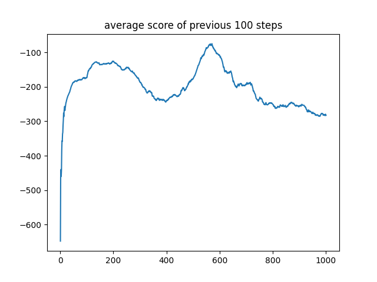
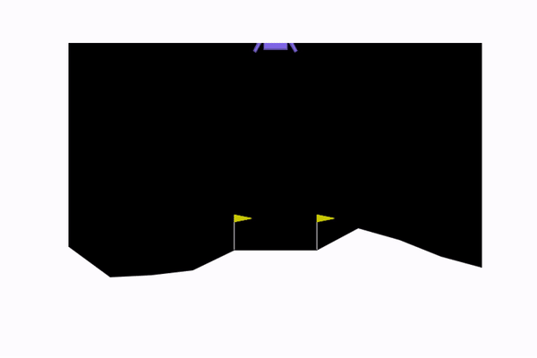

# iLunarLander

  

Training [LunarLander-v2 of GYM](https://gymnasium.farama.org/environments/box2d/lunar_lander/) to successfully land on the moon through the implementation of policy gradient algorithms! Enjoy the journey! 😄

## Table of contents
* [Policy Gradient](#policy-gradient)
* [REINFORCE](#reinforce)
* [TD-ActorCritic](#td-actorcritic)
* [DDPG](#ddpg)

## Policy Gradient

Policy Gradient (PG) methods represent a powerful approach to addressing Reinforcement Learning (RL) problems by directly learning an optimal policy for the agent to maximize cumulative rewards. Unlike Q-learning, which focuses on learning the value of actions, PG methods optimize the policy itself by learning the probability distribution over actions. Here, we have two key concepts:

- **Policy**: The policy, denoted as $\pi_{\theta}(a|s)$, represents the probability of taking action $a$ in state $s$ given the policy parameters $\theta$.
  
- **Objective**: The goal is to maximize the expected return, which is the cumulative reward an agent receives over time.

Each PG-based methodology involves the following steps:

1. **Policy Representation**:
   
   - The policy is parameterized by $\theta$ and is modeled as a probability distribution $\pi_{\theta}(a|s) = \mathcal{P}\{A_t = a | S_t = s\}$.
     
   - A common way to ensure that $\pi$ is a valid probability distribution is to use a softmax function over the action preferences $h(s, a, \theta)$ generated by a neural network.

   $$\pi_{\theta}(a|s) = \frac{\exp(h(s, a, \theta))}{\sum_{a' \in \mathcal{A}} \exp(h(s, a', \theta))}$$

3. **Optimization**:
   
   - We aim to find the optimal policy parameters $\theta$ by defining a performance measure $J(\theta)$ and using gradient ascent to maximize it.
     
   - The policy gradient theorem provides a way to compute the gradient of $J(\theta)$ with respect to $\theta$, as described by Sutton & Barto in [this link](http://incompleteideas.net/book/bookdraft2017nov5.pdf) (also elaborated [here](https://lilianweng.github.io/posts/2018-04-08-policy-gradient/)). Assuming that $\mu$ represents the probability of being in state $s$ according to our stochastic policy $\pi$, while $Q$ denotes an action-value function aligned with this policy, the policy gradient equation is:

     $$\nabla J(\theta) = \sum_{s \in \mathbf{\mathcal{S}}} \mu^{\pi}(s) \left ( \sum_{a \in \mathbf{\mathcal{A}}} Q^{\pi}(s, a) \nabla_{\theta} \pi_{\theta}(a|s) \right ),$$

The following algorithms attempt to solve this optimization problem using their own innovative approaches.

## [REINFORCE](REINFORCE) 

Building on the policy gradient equation, we can devise a straightforward algorithm that utilizes gradient ascent to adjust our policy parameters. While the theoretical formulation involves summing over all states and actions, in practice, we estimate the gradient through sampling. This method is known as REINFORCE (Monte-Carlo policy gradient), introduced by Sutton & Barto. REINFORCE leverages estimated returns obtained via Monte-Carlo methods using episode samples, allowing us to compute an unbiased estimate of the policy gradient. This approach ensures that the expected value of the sampled gradient aligns with the true gradient, making it effective for learning optimal policies. In essence:

$$\begin{eqnarray} 
\nabla J(\theta) &=& \sum_{s \in \mathbf{\mathcal{S}}} \mu^{\pi}(s) \left ( \sum_{a \in \mathbf{\mathcal{A}}} Q^{\pi}(s, a) \nabla_{\theta} \pi_{\theta}(a|s) \right ) \nonumber \\
&=& \mathbb{E}\_{s \sim \pi} \left [ \sum_{a \in \mathbf{\mathcal{A}}} Q^{\pi}(S_{t}, a) \nabla_{\theta} \pi_{\theta}(a|S_{t}) \right ] \nonumber \\
&=& \mathbb{E}\_{s \sim \pi} \left [ \sum_{a \in \mathbf{\mathcal{A}}} \pi_{\theta}(a|S_{t}) Q^{\pi}(S_{t}, a) \frac{\nabla_{\theta} \pi_{\theta}(a|S_{t})}{\pi_{\theta}(a|S_{t})} \right ] \nonumber \\
&=& \mathbb{E}\_{s, a \sim \pi} \left [ Q^{\pi}(S_{t}, A_{t}) \frac{\nabla_{\theta} \pi_{\theta}(A_{t} | S_{t})}{\pi_{\theta}(A_{t} | S_{t})} \right ] \nonumber \\
&=& \mathbb{E}\_{s, a \sim \pi} \left [ Q^{\pi}(S_{t}, A_{t}) \nabla_{\theta} \ln \pi_{\theta}(A_{t} | S_{t}) \right ] \qquad \text{because } (\ln x)^{'} = \frac{1}{x} \nonumber \\
&=& \mathbb{E}\_{s, a \sim \pi} \left [ G_t \nabla_{\theta} \ln \pi_{\theta}(A_{t} | S_{t}) \right ] \qquad \text{because } Q^{\pi}(S_{t}, A_{t}) = \mathbb{E}\_{s, a \sim \pi} \left [ G_t | S_{t}, A_{t} \right ] \nonumber \\
\end{eqnarray}$$

Hence, we can compute $G_t$ from actual sample trajectories and utilize it to adjust our policy gradient. This approach hinges on complete trajectories, hence earning its classification as a Monte-Carlo method. 

### Algorithm

The procedure is rather straightforward:

***
1. Initialize the policy parameter $\theta$ at random.
   
2. Generate one trajectory on policy $\pi_{\theta}$: $S_1, A_1, R_2, S_2, A_2, ..., S_T$.
   
3. For $t = 1, 2, ..., T$:

   a. Estimate the return $G_t$;
   
   b. Update policy parameters: $\theta \gets \theta + \alpha \gamma_t G_t \nabla_{\theta} \ln \pi_{\theta}(A_{t} | S_{t})$
***

This process is implemented in [main.py](REINFORCE/main.py). $G_t$ is estimated using a PyTorch-based Deep Neural Network (DNN) in [PGN.py](REINFORCE/PGN.py), then processed through softmax in [PG_Agent.py](REINFORCE/PG_Agent.py). The resulting per-action probabilities are fed into the Categorical distribution for action selection. The categorical distribution is a discrete probability distribution used to model scenarios where there are a fixed number of possible outcomes, each with an associated probability. It's commonly employed in reinforcement learning to select actions from a set of discrete choices. A fundamental function of the categorical distribution is sampling, which involves randomly selecting an outcome based on its associated probability.

### Outcomes

The average scores (total rewards accumulated) of the lunar lander over 3000 training steps:

  

The following .gif file demonstrates the performance of the lunar lander over 3000 training steps:

  

## [TD-ActorCritic](TD-ActorCritic)

While the REINFORCE algorithm provides a straightforward method to optimize policies using Monte-Carlo samples, it can suffer from high variance and inefficiency in learning. To address these issues, the TD-ActorCritic method introduces a more refined approach by simultaneously learning the value function alongside the policy. This dual learning process helps stabilize and speed up training. In contrast to REINFORCE, which relies solely on sampled returns, TD-ActorCritic employs Temporal Difference (TD) learning to provide more immediate feedback. This results in more accurate and stable policy updates. This method involve two neural networks, which may optionally share parameters:

- **Actor**: This component is responsible for selecting actions. It learns the policy $\pi_{\theta}(a|s)$ to maximize the expected return (which includes the reward and the weighted average expected value of future steps). This is done by adjusting $\theta$ in the direction that increases the likelihood of actions that result in higher returns.

- **Critic**: This component evaluates the actions taken by the actor by learning a value function. The value function can be either the state-value function, $\mathcal{V}\_{\omega}(s)$, which estimates the expected return (total accumulated reward) starting from state $s$, or the action-value function, $Q_{\omega}(s, a)$, which estimates the expected return starting from state $s$ and taking action $a$. The critic aims to improve the accuracy of these estimated values. Minimizing the TD error is a promising approach for achieving this. The TD error is defined as follows:

$$\delta_t = R_t + \gamma \mathcal{V}\_{\omega}(S_{t+1}) - \mathcal{V}\_{\omega}(S_{t})$$
  
where $\mathcal{V}\_{\omega}(S_{t})$ is the value of the current state, $\mathcal{V}\_{\omega}(S_{t+1})$ is the value of the next state, $R_t$ is the reward received, and $\omega$ is the weight vector of the neural network learning the value function.

By incorporating both the actor and the critic, the Actor-Critic method effectively combines policy optimization with value calibration, leading to more efficient and robust learning.

### Algorithm

The procedure is as follows:

***
1. Initialize the policy parameter $\theta$ and the value function parameter $\omega$ at random.
   
2. For $t = 1, 2, ..., T$:

   a. The actor selects an action $A_t$ based on the current policy, $\pi_{\theta}$.
   
   b. The action $A_t$ is executed, and the environment returns a new state $S_{t+1}$ and a reward $R_t$.

   c. The critic evaluates the taken action by computing the temporal difference (TD) error, $\delta_t$.

   d. Update the critic’s value function parameters, $\omega$, using the TD error: $\omega \leftarrow \omega + \alpha_{critic} \delta_t \nabla_{\omega} \mathcal{V}\_{\omega}(S_{t})$

   e. Update the Actor’s policy distribution parameters, $\theta$, using the TD error: $\theta \gets \theta + \alpha_{actor} \gamma_t \delta_t \nabla_{\theta} \ln \pi_{\theta}(A_{t} | S_{t})$
***

This process is implemented in [main.py](TD-ActorCritic/main.py). Since the lunar landing problem is not overly complex, a single shared PyTorch-based DNN, defined in [ACN.py](TD-ActorCritic/ACN.py), is used to estimate both action probabilities and state values. These estimations are then processed in [AC_Agent.py](TD-ActorCritic/AC_Agent.py). The resulting per-action probabilities are fed into a Categorical distribution for action selection, similar to the REINFORCE algorithm.

### Outcomes

The average scores (total rewards accumulated) of the lunar lander over 3000 training steps:

  

The following .gif file demonstrates the performance of the lunar lander over 3000 training steps:

  

## [DDPG](DDPG)

The TD-ActorCritic method is effective in combining value-based and policy-based approaches for reinforcement learning, but it often struggles with stability and efficiency in continuous action spaces. Deep Deterministic Policy Gradient (DDPG), as described by Lillicrap in [this link](https://arxiv.org/abs/1509.02971), enhances TD-ActorCritic by employing deep learning to stabilize and optimize both the actor and critic networks. This approach is particularly suited for environments with continuous action spaces, where it outperforms traditional methods by integrating strategies like experience replay and target networks. The main components of DDPG are as follows:

- **Actor Network**: The actor network selects actions deterministically given the current state. It learns a policy function $\mu_{\theta}(s)$, which maps states to a specific action directly.
  
- **Critic Network**: The critic network evaluates the actions taken by the actor by learning the Q-value function $Q_{\omega}(s, a)$, which estimates the expected return for a given state-action pair.

- **Experience Replay Buffer**: A memory buffer that stores tuples of state, action, reward, next state, and done signal. By sampling mini-batches of experiences from this buffer, the network updates are stabilized and decorrelated.

- **Target Networks**: These are delayed copies of the actor and critic networks that are updated slowly to provide stable targets during learning.

### Algorithm

The DDPG algorithm can be outlined as follows:

***
1. Randomly initialize the actor network $\mu_{\theta}(s)$ and the critic network $Q_{\omega}(s, a)$ with weights $\theta$ and $\omega$ respectively.

2. Initialize target networks $\theta'$ and $\omega'$ with weights $\theta' \leftarrow \theta$ and $\omega' \leftarrow \omega$.

3. Initialize the replay buffer $\mathcal{R}$.

4. Receive the initial state $S_0$.

5. For $t = 1, 2, ..., T$:

   - Initialize a random process $\mathcal{N}$ for action exploration.
     
   - Select action $A_t = \mu_{\theta}(S_t) + \mathcal{N}_t$ according to the current policy and exploration noise.
     
   - Execute action $A_t$ and observe reward $R_t$ and new state $S_{t+1}$.
     
   - Store transition $(S_t, A_t, R_t, S_{t+1})$ in the replay buffer $\mathcal{R}$.
     
   - Sample a random mini-batch of $N$ transitions from the replay buffer.
   
   - Compute target value $y_i = R_i + \gamma Q_{\omega'}(S_{i+1}, \mu_{\theta'}(S_{i+1}))$ for $0 \leq i \leq N$.
     
   - Update critic by minimizing the loss: $L = \frac{1}{N} \sum_i (y_i - Q_{\omega}(S_i, A_i))^2$.
   
   - Update the actor policy using the sampled policy gradient: $\nabla_{\theta} J \approx \frac{1}{N} \sum_i \nabla_a Q_{\omega}(s, a) \big|\_{s=S_i, a=\mu_{\theta}(S_i)} \nabla_{\theta} \mu_{\theta}(s) \big|_{S_i}$.
   
   - Update target networks: $\theta' \leftarrow \tau \theta + (1 - \tau) \theta'$ and $\omega' \leftarrow \tau \omega + (1 - \tau) \omega'$.
***

This process is implemented in [main.py](DDPG/main.py). The actor and critic networks, defined in [ADN.py](DDPG/ADN.py) and [CDN.py](DDPG/CDN.py) 
respectively, leverage PyTorch for model building and optimization. All structures and parameters are configured based on the source paper. The replay buffer is defined in [Memory.py](DDPG/Memory.py), and the noise function is introduced in [OU_Noise.py](DDPG/OU_Noise.py) based on the Ornstein–Uhlenbeck process (see [this link](https://en.wikipedia.org/wiki/Ornstein%E2%80%93Uhlenbeck_process#Mathematical_properties)).

### Outcomes

The average scores (total rewards accumulated) of the lunar lander over 1000 training steps are illustrated below. Personally, I expected better outcomes, but DDPG exhibits highly variable performance from run to run. This fluctuations may be due to the parameters, which could be tuned for specific applications. For the lunar lander, we may need different parameters. Additionally, I believe that better action selection strategies, such as epsilon-greedy, could significantly improve performance.

  

The following .gif file demonstrates the performance of the lunar lander over 1000 training steps:

  

## Getting Started

Ensure that you've installed all the packages listed in [requirements.txt](REINFORCE/requirements.txt) and execute [main.py](REINFORCE/main.py). The resulting figures will be saved in [plots](REINFORCE/plots/). Moreover, you can observe the lunar lander and its operations under the agent's control using `env.render()`. For a sample code, refer to [test.py](REINFORCE/test.py).

---

Thank you for exploring PG with us! We hope you find this repository helpful and inspiring as you dive into the world of PG-based RL.
