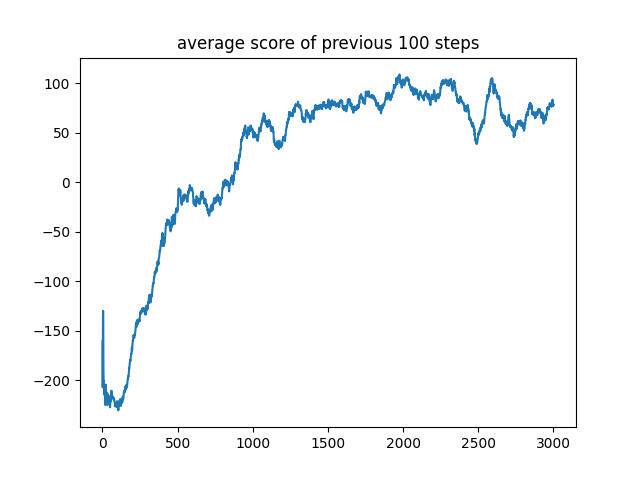
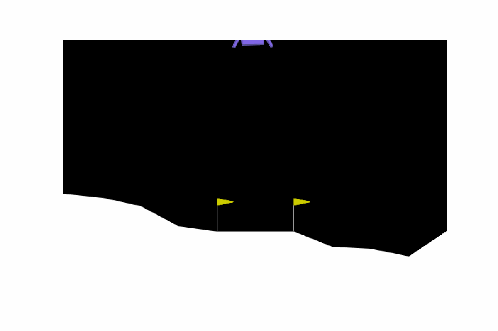

# iLunarLander

  

Training [LunarLander-v2 of GYM](https://gymnasium.farama.org/environments/box2d/lunar_lander/) to successfully land on the moon through the implementation of policy gradient algorithms! Enjoy the journey! 😄

## Table of contents
* [Policy Gradient (PG)](#policy-gradient-pg)
* [REINFORCE](#reinforce)
* [TD-ActorCritic](#td-actorcritic)

## Policy Gradient (PG)

PG represents an approach to tackling Reinforcement Learning (RL) challenges, striving to discover an optimal behavioral strategy (or policy) for the agent to acquire maximum rewards. PG methods focus on modeling and enhancing the policy directly from the probability distribution of actions, contrasting with Q-learning where the agent selects the best action directly based on state-action values.

The policy is typically represented by a parameterized function with respect to $\theta$, denoted as $\pi_{\theta}(a|s)$, where $a$ and $s$ represent the action and the state, respectively. $\pi_{\theta}(a|s) = \mathcal{P} \lbrace A_{t} = a | S_{t} = s \rbrace$ signifies the probability of an action $a$ at time step $t$, given the state $s$ at timestep $t$ and the parameters $\theta$ of the policy.

Now if we ensure that $\pi$ is a valid probability distribution with respect to ${\theta}$, we can then define a performance measure function $J(\theta)$ and employ gradient ascent to adjust $\theta$ in order to discover the optimal policy: $\theta\_{t+1} = \theta\_{t} + \alpha \nabla J(\theta\_{t})$.

Ensuring probabilistic validity often involves feeding the values of each state-action pair ($s, a$) (such as those generated by a neural network with parameters $\theta$ after receiving a state) into a softmax function, where the result is denoted by $h(s, a, \theta)$. This process guarantees that $\pi_{\theta}(a|s) \in (0, 1)$, as demonstrated below:

$$\pi_{\theta}(a|s) = \frac{\exp h(s, a, \theta)}{\sum_{a' \in \mathbf{\mathcal{A}}} \exp h(s, a', \theta)}$$

By following this approach, action preferences enable the agent to adopt a deterministic policy, shaping a probability distribution. Consequently, the likelihood of the best action tends toward $1$. Another benefit is the smooth adjustment of action probabilities across a function of the policy parameter. This mitigates issues such as overestimation of the importance of a selected action, thus avoiding convergence into a suboptimal policy, a common pitfall in methods like epsilon greedy.

Now, let's delve into defining $J(\theta)$ and computing its gradient. Sutton & Barto, in [this link](http://incompleteideas.net/book/bookdraft2017nov5.pdf) (also elaborated [here](https://lilianweng.github.io/posts/2018-04-08-policy-gradient/)), tackled this issue and demonstrated that the gradient adheres to the following equation:

$$\nabla J(\theta) = \sum_{s \in \mathbf{\mathcal{S}}} \mu(s) \left ( \sum_{a \in \mathbf{\mathcal{A}}} Q^{\pi}(s, a) \nabla_{\theta} \pi_{\theta}(a|s) \right ),$$
  
where $\mu(s)$ represents the probability of being in state $s$ according to our stochastic policy $\pi$, while $Q$ denotes an action-value function aligned with this policy.

## [REINFORCE](REINFORCE) 

Now equipped with the policy gradient equation, we can devise a straightforward algorithm leveraging gradient ascent to adjust our policy parameters. While the theorem encompasses a summation over all states and actions, given the impracticality of computing gradients for all potential states and actions, we can rely on a sampled gradient. This method is known as REINFORCE (Monte-Carlo policy gradient), introduced by Sutton & Barto, which relies on estimated returns obtained through Monte-Carlo methods using episode samples. REINFORCE proves effective because the expectation of the sample gradient aligns with the actual gradient. In essence:

$$\begin{eqnarray} 
\nabla J(\theta) &=& \sum_{s \in \mathbf{\mathcal{S}}} \mu(s) \left ( \sum_{a \in \mathbf{\mathcal{A}}} Q^{\pi}(s, a) \nabla_{\theta} \pi_{\theta}(a|s) \right ) \nonumber \\
&=& \mathbb{E}\_{s \sim \pi} \left [ \sum_{a \in \mathbf{\mathcal{A}}} Q^{\pi}(S_{t}, a) \nabla_{\theta} \pi_{\theta}(a|S_{t}) \right ] \nonumber \\
&=& \mathbb{E}\_{s \sim \pi} \left [ \sum_{a \in \mathbf{\mathcal{A}}} \pi_{\theta}(a|S_{t}) Q^{\pi}(S_{t}, a) \frac{\nabla_{\theta} \pi_{\theta}(a|S_{t})}{\pi_{\theta}(a|S_{t})} \right ] \nonumber \\
&=& \mathbb{E}\_{s, a \sim \pi} \left [ Q^{\pi}(S_{t}, A_{t}) \frac{\nabla_{\theta} \pi_{\theta}(A_{t} | S_{t})}{\pi_{\theta}(A_{t} | S_{t})} \right ] \nonumber \\
&=& \mathbb{E}\_{s, a \sim \pi} \left [ Q^{\pi}(S_{t}, A_{t}) \nabla_{\theta} \ln \pi_{\theta}(A_{t} | S_{t}) \right ] \qquad \text{because } (\ln x)^{'} = \frac{1}{x} \nonumber \\
&=& \mathbb{E}\_{s, a \sim \pi} \left [ G_t \nabla_{\theta} \ln \pi_{\theta}(A_{t} | S_{t}) \right ] \qquad \text{because } Q^{\pi}(S_{t}, A_{t}) = \mathbb{E}\_{s, a \sim \pi} \left [ G_t | S_{t}, A_{t} \right ] \nonumber \\
\end{eqnarray}$$

Hence, we can compute $G_t$ from actual sample trajectories and utilize it to adjust our policy gradient. This approach hinges on complete trajectories, hence earning its classification as a Monte-Carlo method. 

### Algorithm

The procedure is rather straightforward:

***
1. Initialize the policy parameter $\theta$ at random.
   
2. Generate one trajectory on policy $\pi_{\theta}$: $S_1, A_1, R_2, S_2, A_2, ..., S_T$.
   
3. For $t = 1, 2, ..., T$:

   a. Estimate the return $G_t$;
   
   b. Update policy parameters: $\theta \gets \theta + \alpha \gamma_t G_t \nabla_{\theta} \ln \pi_{\theta}(A_{t} | S_{t})$
***

This process is implemented in [main.py](REINFORCE/main.py). $G_t$ is estimated using a PyTorch-based Deep Neural Network (DNN) in [PGN.py](REINFORCE/PGN.py), then processed through softmax in [PG_Agent.py](REINFORCE/PG_Agent.py). The resulting per-action probabilities are fed into the Categorical distribution for action selection. The categorical distribution is a discrete probability distribution used to model scenarios where there are a fixed number of possible outcomes, each with an associated probability. It's commonly employed in reinforcement learning to select actions from a set of discrete choices. A fundamental function of the categorical distribution is sampling, which involves randomly selecting an outcome based on its associated probability.

### Outcomes

The average scores (total rewards accumulated) of the lunar lander over 3000 training steps:

  

The following .gif file demonstrates the performance of the lunar lander over 3000 training steps:

  

## [TD-ActorCritic](TD-ActorCritic)

In policy gradient methods, two main components are crucial: the policy distribution and the expected return. Learning the value function alongside the policy is beneficial, as it is expected to enhance the policy update process. This is the fundamental idea behind the Actor-Critic method. Actor-Critic methods involve two neural networks, which may optionally share parameters:

- **Actor**: This component is responsible for selecting actions. It learns the policy $\pi_{\theta}(a|s)$ to maximize the expected return (which includes the reward and the weighted average expected value of future steps). This is done by adjusting $\theta$ in the direction that increases the likelihood of actions that result in higher returns.

- **Critic**: This component evaluates the actions taken by the actor by learning a value function. The value function can be either the state-value function, $\mathcal{V}\_{\omega}(s)$, which estimates the expected return (total accumulated reward) starting from state $s$, or the action-value function, $Q_{\omega}(s, a)$, which estimates the expected return starting from state $s$ and taking action $a$. The critic aims to improve the accuracy of these estimated values. Minimizing the Temporal Difference (TD) error is a promising approach for achieving this. The TD error is defined as follows:

$$\delta_t = r_t + \gamma \mathcal{V}\_{\omega}(s_{t+1}) - \mathcal{V}\_{\omega}(s_{t})$$
  
where $\mathcal{V}\_{\omega}(s_{t})$ is the value of the current state, $\mathcal{V}\_{\omega}(s_{t+1})$ is the value of the next state, $r_t$ is the reward received, and $\omega$ is the weight vector of the neural network learning the value function.

By incorporating both the actor and the critic, the Actor-Critic method effectively combines policy optimization with value calibration, leading to more efficient and robust learning.

### Algorithm

The procedure is as follows:

***
1. Initialize the policy parameter $\theta$ and the value function parameter $\omega$ at random.
   
2. For $t = 1, 2, ..., T$:

   a. The actor selects an action $A_t$ based on the current policy, $\pi_{\theta}$.
   
   b. The action $A_t$ is executed, and the environment returns a new state $S_{t+1}$ and a reward $R_t$.

   c. The critic evaluates the taken action by computing the temporal difference (TD) error, $\delta_t$.

   d. Update the critic’s value function parameters, $\omega$, using the TD error: $\omega \leftarrow \omega + \alpha_{critic} \delta_t \nabla_{\omega} \mathcal{V}\_{\omega}(S_{t})$

   e. Update the Actor’s policy distribution parameters, $\theta$, using the TD error: $\theta \gets \theta + \alpha_{actor} \gamma_t \delta_t \nabla_{\theta} \ln \pi_{\theta}(A_{t} | S_{t})$
***

This process is implemented in [main.py](TD-ActorCritic/main.py). Since the lunar landing problem is not overly complex, a single shared PyTorch-based DNN, defined in [ACN.py](TD-ActorCritic/ACN.py), is used to estimate both action probabilities and state values. These estimations are then processed in [AC_Agent.py](TD-ActorCritic/AC_Agent.py). The resulting per-action probabilities are fed into a Categorical distribution for action selection, similar to the REINFORCE algorithm.

### Outcomes

The average scores (total rewards accumulated) of the lunar lander over 3000 training steps:

  

The following .gif file demonstrates the performance of the lunar lander over 3000 training steps:

  

## Getting Started

Ensure that you've installed all the packages listed in [requirements.txt](REINFORCE/requirements.txt) and execute [main.py](REINFORCE/main.py). The resulting figures will be saved in [plots](REINFORCE/plots/). Moreover, you can observe the lunar lander and its operations under the agent's control using `env.render()`. For a sample code, refer to [test.py](REINFORCE/test.py).
